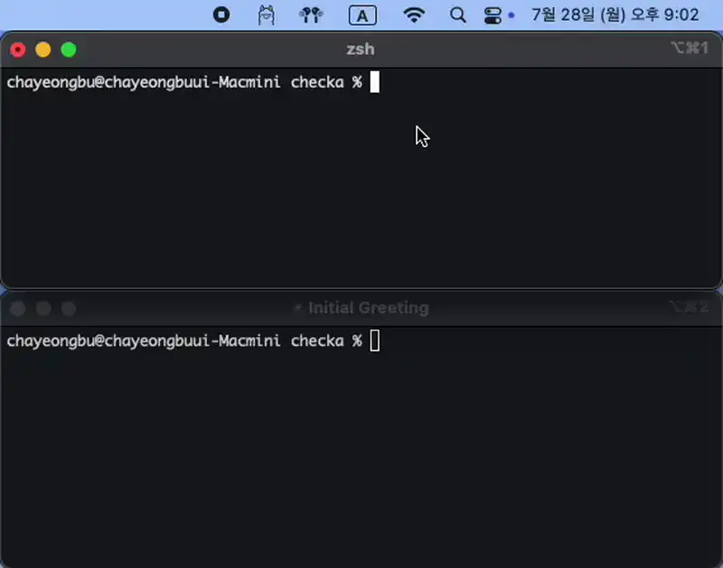

# Checka

> Do you ever miss when your AI agent finishes a task while you're working on something else?

Checka is a macOS project-specific AI agent monitoring tool. Monitor Claude Code and other AI agents running in your current project directory in real-time!



## Key Features

- **Real-time Status**: Check if AI agents are processing, waiting, or idle in real-time
- **Project-specific**: Monitor AI agents only in your current working directory
- **Clean Interface**: Simple menubar interface showing current project and agent status

## Supported AI Agents

- Claude Code
- Gemini CLI
- (WIP) Cursor Agent
- (WIP) GitHub Copilot CLI

## System Requirements

- macOS 10.15 (Catalina) or later
- Intel Mac or Apple Silicon Mac

## Installation

### Method 1: Local Build (Recommended)

Build and install Checka as a system CLI tool:

```bash
# Clone the repository
git clone https://github.com/kennycha/checka.git
cd checka

# Install dependencies and build
pnpm install
pnpm tauri build

# Install as system command (requires sudo)
sudo ln -s $(pwd)/src-tauri/target/release/checka /usr/local/bin/checka
```

Now you can use `checka` from any project directory:

```bash
cd /your-project
checka  # Monitor AI agents in current directory
```

> **Note**: Checka requires local building rather than distributing pre-built binaries due to macOS security restrictions.

### Method 2: Development Mode

For development or testing:

```bash
# Clone and run in development mode
git clone https://github.com/kennycha/checka.git
cd checka
pnpm install
pnpm tauri dev
```

### Interface

1. **Current Project**: Shows the directory being monitored (📁 project-name)
2. **Agent Status**:
   - 🟢 **Processing**: AI agent is actively working (>1% CPU)
   - 🟡 **Waiting**: AI agent is running but waiting for input
   - ⚪ **Off**: No AI agent detected in current directory
3. **Active Count**: Shows "X/Y active" (processing + waiting / total agents)
4. **Quit**: Click "Quit" to exit the app

### Workflow Example

```bash
# Start working on a project
cd /Users/john/my-web-app

# Launch Checka to monitor this project only
checka

# Start using Claude Code in this directory
claude "help me refactor this component"

# Checka will show Claude Code status in the menubar
# Switch to other work while Claude processes
# Get notified when Claude finishes via status change
```

## Why Checka?

Modern development increasingly involves AI agents handling code tasks while developers multitask on other work like planning, documentation, or team collaboration.

The problem: **You miss when AI agents finish their work**, creating inefficient "dead time" where completed tasks go unnoticed.

Checka solves this by providing **project-specific, real-time monitoring** of AI agent activity, so you can:

- Work on other tasks while AI agents process
- Get immediate visual feedback when agents finish
- Stay focused on your current project only
- Maximize efficiency in human-AI collaboration

## Development

### Prerequisites

- [Node.js](https://nodejs.org/) (LTS version)
- [pnpm](https://pnpm.io/) package manager
- [Rust](https://rustup.rs/) toolchain
- Xcode Command Line Tools (macOS)

### Development Commands

```bash
# Start development server
pnpm tauri dev

# Build for production
pnpm tauri build

# Frontend development only
pnpm dev
```

## Tech Stack

- **Frontend**: React 19 + TypeScript + Vite
- **Backend**: Rust + Tauri v2
- **Package Manager**: pnpm
- **Platforms**: macOS (Intel + Apple Silicon)

## Credits

This app is based on [ahkohd](https://github.com/ahkohd)'s [tauri-macos-menubar-app-example](https://github.com/ahkohd/tauri-macos-menubar-app-example).

## Contributing

Please report bugs or suggest features in [Issues](https://github.com/kennycha/checka/issues)!

## License

MIT License - Feel free to use!

---

_Made with ❤️ for developers who love AI coding tools_
